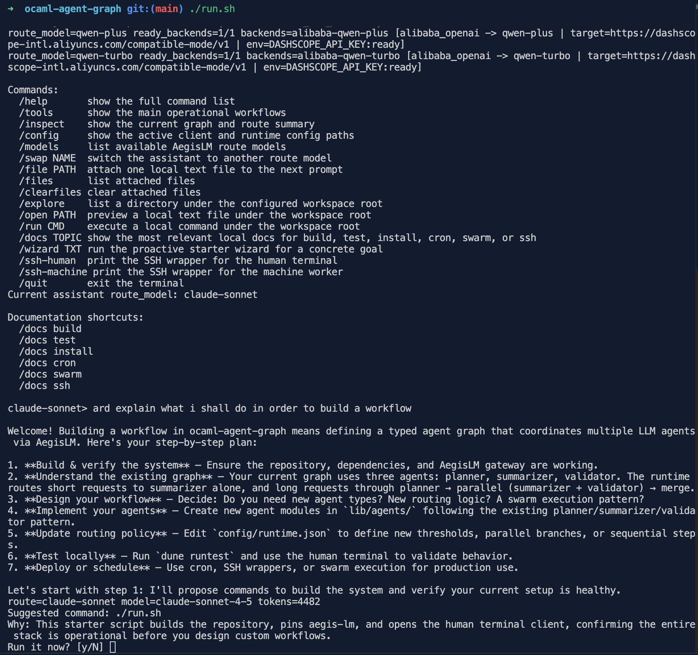

# ocaml-agent-graph

[](https://github.com/Louis-Ph/ocaml-agent-graph/actions/workflows/ci.yml)

Typed, modular multi-agent orchestration in OCaml. Think LangGraph or CrewAI,
but with explicit typed routing, tamper-evident audit, and a real terminal you
can use right now.



## Quick start

One command on any machine (Linux, macOS, FreeBSD):

```bash
curl -fsSL https://raw.githubusercontent.com/Louis-Ph/ocaml-agent-graph/main/install.sh | sh
```

or with wget:

```bash
wget -qO- https://raw.githubusercontent.com/Louis-Ph/ocaml-agent-graph/main/install.sh | sh
```

That single command installs git and the OCaml toolchain if needed, clones this
repo and [BulkheadLM](https://github.com/Louis-Ph/bulkhead-lm), and opens the
human terminal. Press ENTER at every prompt.

If you already have the repo:

```bash
./run.sh
```

BulkheadLM is automatically pulled to the latest version on every run. You
never need to update it manually.

### What you need before you start

1. One API key from any provider BulkheadLM supports (OpenRouter, Anthropic,
   OpenAI, Google, Mistral, DeepSeek, Groq, and many others).
2. Put it in a secrets file:

```bash
printf 'export OPEN_ROUTER_KEY="paste-your-key-here"\n' >> ~/.bashrc.secrets
```

3. Run the one-liner above.
4. Type a question in the terminal. Done.

## What it does

You type a question. A team of AI agents works on it together:

```text
Short question  ->  summarizer  ->  answer
Long question   ->  planner  ->  summarizer + validator in parallel  ->  answer
```

With discussion mode enabled (default):

```text
Long question  ->  planner  ->  multi-agent discussion (N rounds)  ->  synthesis  ->  answer
```

With the `/decide` command, you get a full verifiable decision:

```text
/decide "Should we migrate to Kubernetes?"
  ->  structured discussion
  ->  consensus vote (all agents vote, quorum required)
  ->  validator pipeline (winner is checked)
  ->  pattern fitness recorded
  ->  tamper-evident audit chain sealed
  ->  archived to var/decisions/
```

## Terminal commands

| Command | What it does |
|---------|-------------|
| just type | Chat with the assistant |
| `/graph TEXT` | Execute the typed orchestration graph |
| `/discussion TEXT` | Force the multi-agent discussion path |
| `/decide TEXT` | Verifiable decision with audit trail |
| `/models` | List available AI models |
| `/inspect` | Show the graph and route summary |
| `/wizard TEXT` | Guided workflow for build, deploy, SSH, etc. |
| `/docs TOPIC` | Surface relevant documentation |
| `/mesh` | Show the SSH and HTTP transport map |

## Configuration

Everything is in JSON. No code changes needed.

| File | What it controls |
|------|-----------------|
| `config/runtime.json` | Agent models, timeouts, retries, discussion rounds |
| `config/memory_policy.json` | Swarm memory storage, reload, compression |
| `config/discussion/personas/` | Versioned persona files for each participant |
| `config/discussion/rules/` | Versioned rules for each participant |

The shipped config mixes providers on purpose to show multi-provider routing:

- planner: `claude-sonnet` (Anthropic)
- summarizer: `kimi-latest` (Moonshot)
- validator: `openrouter-gpt-5.2` (OpenRouter)
- discussion: `claude-sonnet`, `kimi-k2.5`, `openrouter-auto`

Change `route_model` in `config/runtime.json` to use whichever models you have
keys for. BulkheadLM validates that every configured route exists at startup.

## Swarm layers (L0-L3)

The framework ships five typed coordination layers. Use them from any OCaml
program with `open Agent_graph`:

| Layer | Module | One-line summary |
|-------|--------|-----------------|
| L0 | `Core.Envelope` | Message provenance: id, correlation, causation, schema version |
| L0 | `Core.Capability` | Permission lattice: Observe < Speak < Coordinate < Audit_write |
| L0.5 | `Core.Audit` | Tamper-evident hash chain; changing any past entry breaks all hashes after it |
| L1 | `Orchestration.Consensus` | Quorum vote: agents run in parallel, majority required |
| L2 | `Orchestration.Pipeline` | Agent sequence with guards; error stops the chain |
| L3 | `Core.Pattern` | Strategy fitness tracking: success rate, latency, confidence |

Full API reference: [`docs/swarm-layers.md`](docs/swarm-layers.md).

## Messenger spokesperson

Each client config can expose a swarm spokesperson through an
OpenAI-compatible endpoint:

- `POST /v1/messenger/chat/completions`
- `GET /v1/messenger/models`

BulkheadLM owns the chat connectors (Telegram, WhatsApp, Messenger, Discord,
etc.). ocaml-agent-graph executes the swarm and returns one spokesperson reply.

Details: [`doc/MESSENGER_CONNECTORS.md`](doc/MESSENGER_CONNECTORS.md).

## Multi-machine

This repository ships explicit multi-machine entrypoints:

| Script | Purpose |
|--------|---------|
| `scripts/remote_human_terminal.sh` | Human SSH terminal |
| `scripts/remote_machine_terminal.sh` | Worker SSH JSONL terminal |
| `scripts/http_machine_server.sh` | Workflow HTTP server |
| `scripts/remote_install.sh --emit-installer` | SSH bootstrap installer |
| `scripts/http_dist_server.sh` | HTTP bootstrap server |

Guide: [`doc/MULTI_MACHINE.md`](doc/MULTI_MACHINE.md).

## Demos

```bash
# Main terminal (interactive chat + /decide + /discussion)
./run.sh

# Typed orchestration demo
dune exec ./bin/ocaml_agent_graph_demo.exe

# Adaptive webcrawler demo
dune exec ./bin/adaptive_webcrawler_demo.exe
```

Scenario packs: [`demos/`](demos/README.md).

## Manual build

If you prefer to manage your own opam switch:

```sh
opam pin add bulkhead_lm ../bulkhead-lm --yes --no-action
opam install . --deps-only --with-test --yes
dune build
dune runtest
```

## How the starter works

The starter (`./run.sh`) handles everything automatically:

- works on any Linux (Debian, Fedora, Arch, Alpine, openSUSE ...), macOS, and FreeBSD
- installs git and opam via the detected package manager if missing
- clones BulkheadLM as a sibling if absent; updates it to the latest version on every run
- recompiles the BulkheadLM library when a new version is detected
- creates a project-local opam switch by default
- loads API keys from `~/.bashrc.secrets`, `~/.zshrc.secrets`, `~/.config/bulkhead-lm/env`

## Further reading

| Doc | Audience |
|-----|----------|
| [`doc/START_HERE.md`](doc/START_HERE.md) | First-time users |
| [`doc/HUMAN_TERMINAL_ASSISTANT.md`](doc/HUMAN_TERMINAL_ASSISTANT.md) | Terminal power users |
| [`doc/MAKE_YOUR_OWN_AGENT.md`](doc/MAKE_YOUR_OWN_AGENT.md) | Developers adding agents |
| [`doc/MULTI_MACHINE.md`](doc/MULTI_MACHINE.md) | Multi-machine deployment |
| [`doc/MESSENGER_CONNECTORS.md`](doc/MESSENGER_CONNECTORS.md) | Chat connector wiring |
| [`docs/swarm-layers.md`](docs/swarm-layers.md) | L0-L3 API reference |
| [`doc/RELEASING.md`](doc/RELEASING.md) | Release process |
| [`CHANGELOG.md`](CHANGELOG.md) | What changed |
| [`CONTRIBUTING.md`](CONTRIBUTING.md) | How to contribute |
